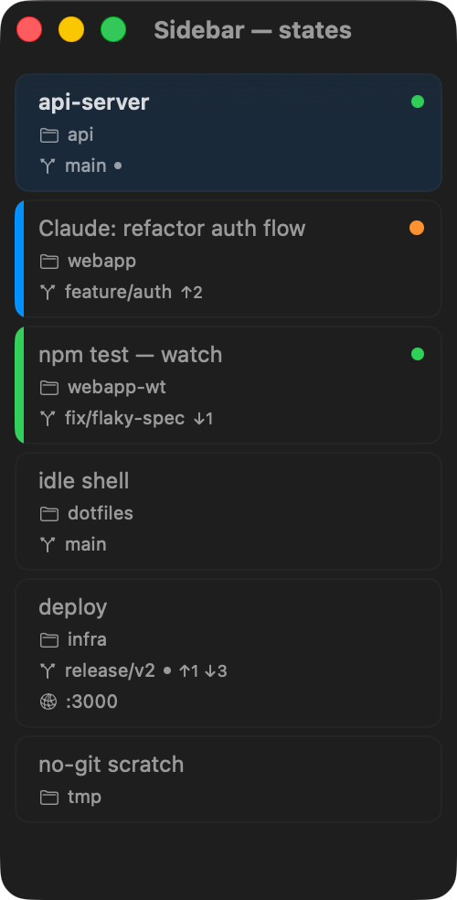

# ghostty-fleet

**A [Ghostty](https://github.com/ghostty-org/ghostty) fork with a left tab sidebar for piloting many
parallel AI-agent (Claude Code) sessions on macOS.** Each tab is a session; the sidebar shows its
title, directory, git branch, custom status, and live attention/working indicators — so a fleet of
agents stays legible at a glance.

> 🧪 **Personal & experimental.** Built for my own use. Not affiliated with, endorsed by, or
> sponsored by the upstream Ghostty project — for the official terminal see
> [ghostty.org](https://ghostty.org).



## Sidebar

Replaces the native tab bar with a left sidebar of rich tab cards:

- **Title, directory, git branch** — branch detected automatically (worktree-aware), no setup.
- **Custom status entries** — show ports, environments, or any metadata via the CLI.
- **Live indicators** — attention, working (foreground process busy), and git dirty/ahead-behind.
- **Drag-and-drop** — reorder tabs by dragging.
- **Theme-aware** — colors derived from your terminal theme (light & dark).

**Dot legend:** 🟠 needs attention (bell/notify) · 🟢 working (foreground process busy) ·
gray ● dirty (uncommitted) · `↑n ↓m` ahead/behind upstream. Orange beats green.

### Config

```
# Choose which fields to show (default: all)
sidebar-fields = title,directory,git-branch,status
```

## Build (macOS)

```bash
make doctor   # verify the toolchain first
make build    # full build: libghostty (Zig) + macOS app
make run      # launch the built app
```

> ⚠️ Building on **macOS 26 (Tahoe)** needs a toolchain workaround — Zig 0.15.2's linker can't link
> the macOS 26.5 SDK's `libSystem` (this affects pristine upstream too, not just the fork). The
> `make`/`build-macos.sh` flow encapsulates the fix; don't hand-run `zig build` for the macOS app.
> See [`AGENTS.md`](AGENTS.md) and [`SIDEBAR-FORK-REPORT.md`](SIDEBAR-FORK-REPORT.md) for details.

## CLI

Install: symlink `cli/ghosttyctl` onto your PATH (`make install-cli`, or e.g. `~/.local/bin/ghosttyctl`).

```bash
ghosttyctl rename "My Tab"                                    # rename tab
ghosttyctl notify --title "Done" --body "Build finished"      # send notification
ghosttyctl set-status server "localhost:3000" --icon network  # add status entry
ghosttyctl clear-status server                                # remove it
ghosttyctl list                                               # list all tabs (incl. foreground_pid)
ghosttyctl current                                            # current tab info
ghosttyctl focus <tab_id>                                     # focus a tab
```

## Claude Code

Add to your `~/.claude/CLAUDE.md` so Claude Code names its tabs and surfaces status in the sidebar:

```markdown
- Rename the workspace using: `ghosttyctl rename "Claude: <name>"`. Name it after the work being done.
- Set sidebar status entries using `ghosttyctl set-status <key> <value> [--icon <sf-symbol>]` and clear with `ghosttyctl clear-status <key>`.
```

## Attribution & License

ghostty-fleet is a personal fork of [Ghostty](https://github.com/ghostty-org/ghostty) by Mitchell
Hashimoto and the Ghostty contributors, used under the MIT License. **Not affiliated with, endorsed
by, or sponsored by the Ghostty project** — for the official terminal see
[ghostty.org](https://ghostty.org).

The left-sidebar tab feature was originally created by Tom Reinert
([tomreinert/ghostty](https://github.com/tomreinert/ghostty)), rebased onto current upstream and
extended (per-session working indicator, worktree-aware git status, IPC server, `ghosttyctl` CLI,
build tooling) by Nikita Kachan ([@Wescholm](https://github.com/Wescholm)).

Licensed under the MIT License — see [LICENSE](LICENSE). Copyright the respective authors above.
